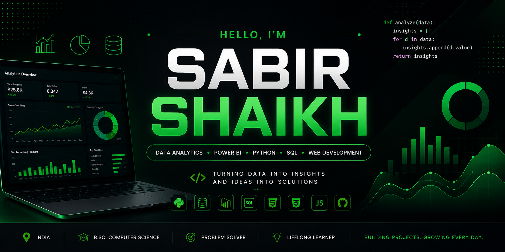
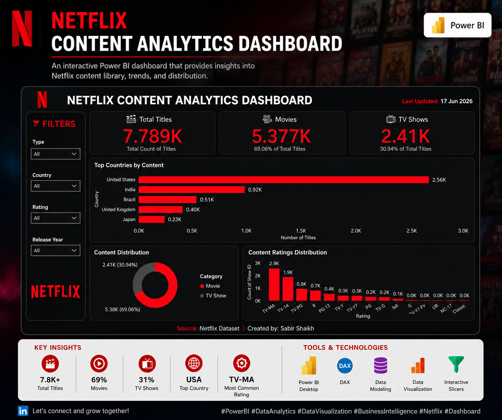
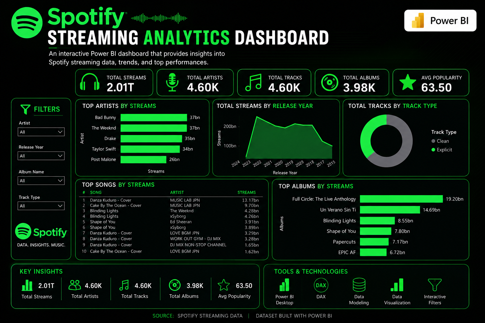
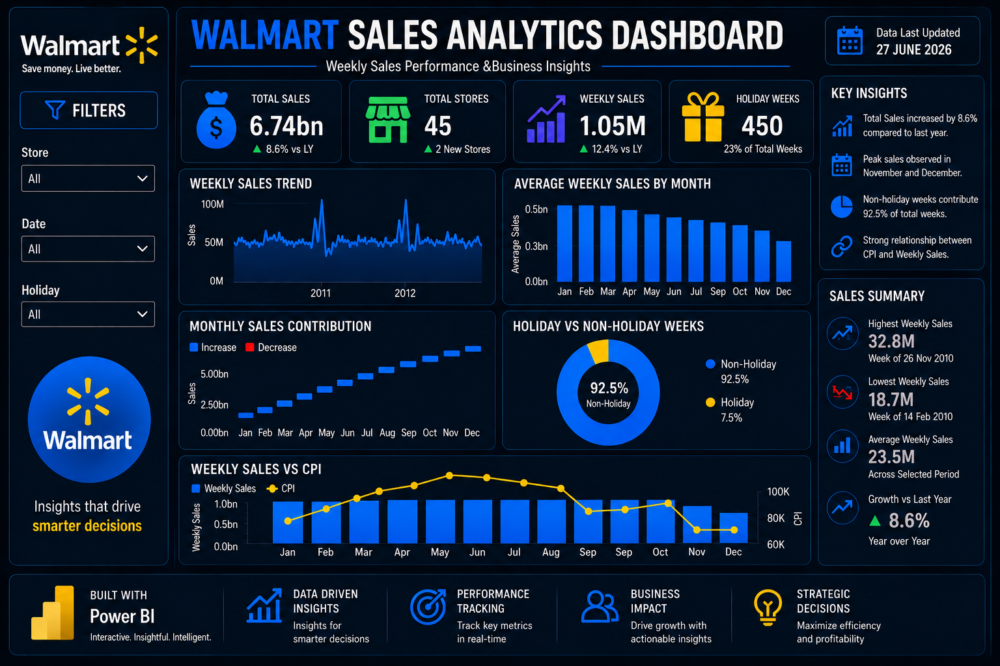
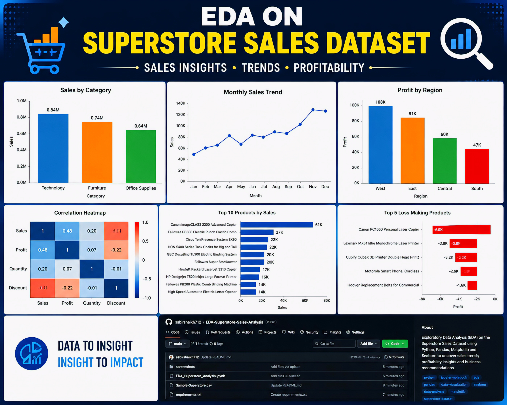

  

<h1 align="center">Sabir Shaikh</h1>

<h3 align="center">
Computer Science Student • Data Analytics Enthusiast • Power BI Developer • Web Developer
</h3>

  

  
  
  

---

# 👋 About Me

🎓 B.Sc. Computer Science Student

📊 Passionate about **Data Analytics**, **Business Intelligence**, and **Data Visualization**

💻 Skilled in **Power BI, Python, SQL, Excel, HTML, CSS, and JavaScript**

🌱 Currently learning **Data Structures & Algorithms**, **Machine Learning**, and **Advanced Power BI**

🚀 I enjoy transforming raw data into meaningful insights and building projects that solve real-world problems.

---

# 🚀 Current Focus

- 📊 Power BI Dashboard Development
- 🐍 Python for Data Analytics
- 🗄 SQL & Database Management
- 🌐 Web Development
- 🤖 Machine Learning Fundamentals

---

# 🛠 Tech Stack

### Programming Languages

### Data Analytics

---

# 🌟 Featured Projects

## 🎬 Netflix Content Analytics Dashboard

Interactive Power BI dashboard analyzing Netflix content trends, ratings, countries, movies, and TV shows.

---

## 🎵 Spotify Streaming Analytics Dashboard

Interactive dashboard providing artist, album, and streaming insights.

---

## 🛒 Walmart Sales Dashboard

Business Intelligence dashboard with KPIs, sales analysis, and profitability insights.

---

## 📊 Superstore Sales EDA

Python-based exploratory data analysis using Pandas and Matplotlib.

---

# 📈 GitHub Statistics

---

# 📊 Contribution Graph

---

# 🏆 GitHub Trophies

---

# 🌱 Currently Learning

- Advanced Power BI
- SQL Optimization
- Machine Learning
- React
- Cloud Fundamentals

---

# 📫 Connect With Me

---

💚 <b>Turning Data into Insights • Building Projects • Learning Every Day 🚀</b>

